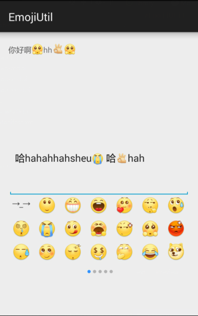

Emoji使用依赖库
===



EmojiUtil使用说明:
---


目前只支持一组表情的操作,多组的支持会在以后完善.

###使用步骤:
1. 初始化EmojiUtil库,如果在布局文件中使用了`EmojiTextView` 、`EmojiEditText`、`EmojiView` 这些空间,但是EmojiUtil未初始化过,
需要在`setContentView()`或者`inflate`之前初始化EmojiUtil库;
2. 在初始化时,需要对`EmojiUtil.emojiId`和`EmojiUtil.emojiName`进行赋值,同时使他们自己的关系一一对应,
同时需要对 `EmojiUtil.regex`进行正则的赋值(具体要根据`EmojiUtil.emojiName`的提取规则).
3. 布局文件中的表情只需在`android:text`进行赋值即可,如果`EmojiTextView`通过代码进行设值的话,需要调用`setEmojiText(CharSequence)`方法
4. 一些控件的使用,可参考下面代码


###示例代码
```java

    EmojiTextView mEmojiTextView = (EmojiTextView) findViewById(R.id.ett_EmojiTextView);
    mEmojiTextView.setEmojiText("你好啊[可爱]hh[ok][可爱]");

    EmojiEditText mEmojiEditText = (EmojiEditText) findViewById(R.id.eet_EmojiEditText);

    EmojiView mEmojiView = (EmojiView) findViewById(R.id.ev_EmojiView);
    mEmojiView.setOnEmojiItemClickListener(new EmojiClickListener() {
        @Override
        public void onClick(CharSequence text) {
            if (mEmojiEditText.getSelectionStart() == mEmojiEditText.length()) {
                mEmojiEditText.append(text);
            } else {
                mEmojiEditText.insert(mEmojiEditText.getSelectionStart(), text);
            }
        }
    });

```

